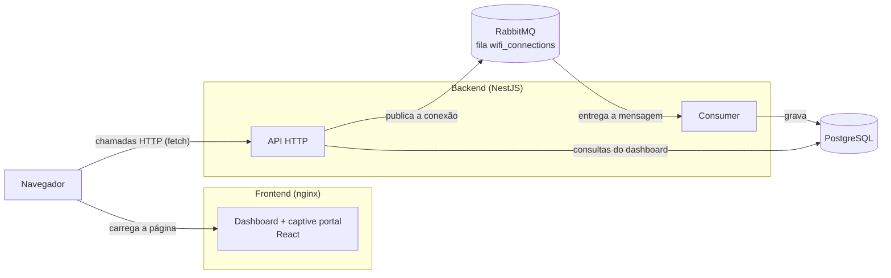
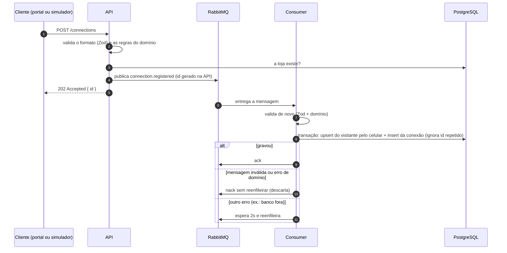

<!-- TODO: estrutura e seções organizadas. Falta escrever o conteúdo dos trechos marcados com "escrever" e apagar estes comentários antes da entrega. -->

# Arquitetura

[← Voltar ao README](../README.md)

## Visão geral

O projeto é um monorepo com npm workspaces:

```
packages/shared/contracts   schemas Zod usados pelo backend e pelo frontend
apps/backend                API NestJS + consumer do RabbitMQ
apps/frontend               dashboard e captive portal (React + Vite)
docker-compose.yml          postgres, rabbitmq, backend e frontend
```



O nginx só entrega os arquivos estáticos do frontend. O navegador chama a API diretamente, no endereço definido em `VITE_API_URL`. A API e o consumer rodam no mesmo processo (aplicação híbrida do NestJS).

<!-- escrever: por que essa divisão, e por que o consumer fica no mesmo processo neste projeto. -->

## Fluxo de uma conexão



<!-- escrever: por que usar fila (picos de conexão, resposta rápida, nada se perde se o banco
cair) e por que a resposta é 202 e não 201. -->

### Idempotência

<!-- escrever: o RabbitMQ entrega "pelo menos uma vez". O id da conexão é gerado na API antes
de publicar, e o insert usa ON CONFLICT (id) DO NOTHING, então uma entrega repetida não
duplica a visita. O upsert do visitante pelo celular também pode repetir sem problema. -->

## Contratos compartilhados

O pacote `@wifi/contracts` (`packages/shared/contracts/src/`) define com Zod o formato de tudo que passa entre frontend e backend:

| Arquivo          | Conteúdo                                                                    |
| ---------------- | --------------------------------------------------------------------------- |
| `connections.ts` | registro de conexão (visitante, aparelho), evento da fila, regex do celular |
| `stores.ts`      | lojas com métricas, query e página de visitantes                            |
| `metrics.ts`     | query e resposta do resumo de visitas                                       |
| `period.ts`      | campos `from`/`to` e a regra `from <= to`                                   |
| `errors.ts`      | formato de erro da API `{ statusCode, message, issues? }`                   |

Quem usa cada schema:

- **Backend:** valida as requisições que chegam (`ZodValidationPipe`) e as mensagens que saem da fila (consumer).
- **Frontend:** valida as respostas da API (`dashboard-api.ts`) e o formulário do captive portal.

<!-- escrever: o ganho de ter uma fonte única do formato dos dados. -->

## Arquitetura hexagonal no backend

<!-- escrever: por que hexagonal (domínio e casos de uso não conhecem NestJS, Postgres nem
RabbitMQ), o que isso permite nos testes e na troca de tecnologia. Detalhes das camadas em
docs/backend.md. -->
