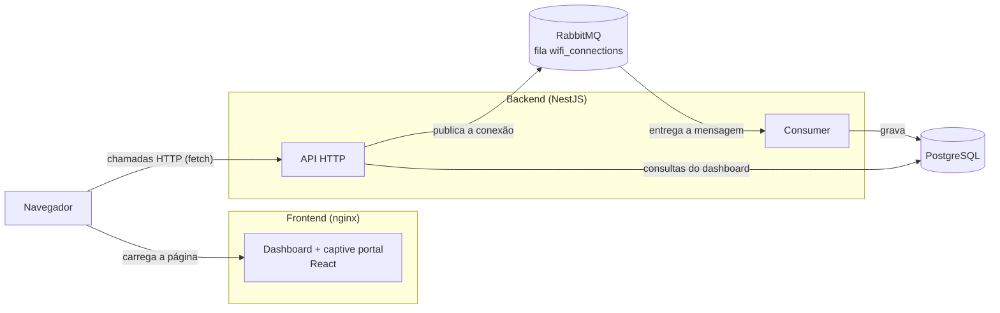
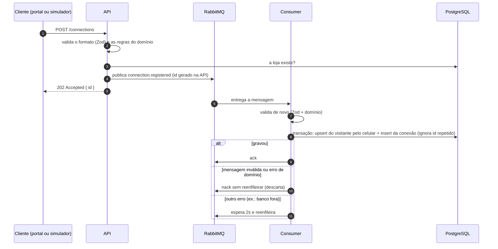
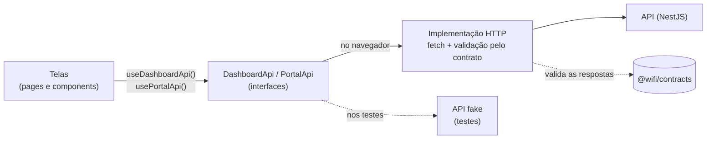

# Arquitetura

[← Voltar ao README](../README.md)

## Visão geral

O projeto é um monorepo com npm workspaces:

```
packages/shared/contracts   schemas Zod usados pelo backend e pelo frontend, definindo contratos entre as frentes
apps/backend                API em NestJS + consumer do RabbitMQ
apps/frontend               dashboard e captive portal (React + Vite)
docker-compose.yml          postgres, rabbitmq, backend e frontend
```



O nginx só entrega os arquivos estáticos do frontend. O navegador chama a API diretamente, no endereço definido em `VITE_API_URL`. A API e o consumer rodam no mesmo processo (aplicação híbrida do NestJS).

## Fluxo de uma conexão



A fila fica entre o registro e a gravação por três motivos: absorver picos de conexão, já que o número de lojas reais ultrapassa 4000 e muitas pessoas conectam ao mesmo tempo (ex.: sábado à tarde); responder rápido ao portal com **202**, sem esperar a gravação no banco; e não perder conexões se o banco cair, pois a mensagem fica na fila até o consumer conseguir gravar.

### Idempotência

O RabbitMQ entrega cada mensagem pelo menos uma vez, então a mesma conexão pode chegar repetida. Por isso o id da conexão é gerado na API antes de publicar, e a gravação usa `ON CONFLICT (id) DO NOTHING`: uma entrega repetida não duplica a visita. O upsert do visitante pelo celular também pode se repetir sem problema.

## Contratos compartilhados

O pacote `@wifi/contracts` (`packages/shared/contracts/src/`) define com Zod o formato de tudo que passa entre frontend e backend:

| Arquivo          | Conteúdo                                                                      |
| ---------------- | ----------------------------------------------------------------------------- |
| `connections.ts` | registro de conexão (visitante, aparelho), evento da fila, regex do celular   |
| `stores.ts`      | lojas com métricas, query e página de visitantes                              |
| `metrics.ts`     | query e resposta do resumo e dos padrões de visita (dia, hora, mês e estação) |
| `period.ts`      | campos `from`/`to` e a regra `from <= to`                                     |
| `errors.ts`      | formato de erro da API `{ statusCode, message, issues? }`                     |

Quem usa cada schema:

- **Backend:** valida as requisições que chegam (`ZodValidationPipe`) e as mensagens que saem da fila (consumer).
- **Frontend:** valida as respostas da API (`api/http.ts`) e o formulário do captive portal.

É uma ótima e interessantissima prática definir contratos/schemas de comunicação de validação entre duas frente que possuem atuações sobre o mesmo domínio e para proposta da solução utilizem os mesmos dados para trabalho.

## Arquitetura hexagonal no backend

A arquitetura hexagonal nos permite manter centralizado a parte de domínio e lógica de negócio, podendo "isolar" a aplicação da solução de software, qual facilita a questão de testes, troca de infraestrutura, por exemplo, para caso seja necessária a remoção do serviço de filas/mensageiria. Para um projeto realizado como esse para o desafio, a arquitetura hexagonal traz complexidade, mas em projetos reais aplicados, a complexidade é convertida em estrutura a longo prazo, escalabilidade, manutenabilidade e demais beneficios mencionados anteriormente em termos de código.

## Arquitetura do frontend

O frontend é uma SPA em React 19 + Vite, sem biblioteca de roteamento nem de estado global. A proposta foi aplicar a mesma separação de responsabilidades do backend, em escala menor: as telas não conhecem o `fetch`, a comunicação com a API passa por uma interface, e os formatos dos dados vêm do mesmo contrato usado pelo backend. As telas, a organização das pastas e os estados da interface estão em [Frontend](./frontend.md); esta seção explica as escolhas de arquitetura.



### Comunicação com a API

- **A API chega às telas por contexto, através de uma interface.**
  - As telas dependem das interfaces `DashboardApi` e `PortalApi`, e não do `fetch`. O `main.tsx` injeta a implementação HTTP, e os testes injetam uma API fake. É a mesma ideia de portas e adaptadores do backend: trocar a forma de comunicação não altera nenhum componente.
- **Uma API para cada tela, separada por responsabilidade.**
  - O dashboard só consulta dados (métricas, lojas e usuários), e o captive portal só lista as lojas e registra a conexão. Cada tela recebe apenas as chamadas que utiliza.
- **Contrato validado em tempo de execução, e não só nos tipos.**
  - Os tipos do frontend são inferidos dos schemas Zod de `@wifi/contracts`, sem tipos duplicados manualmente. Além disso, toda resposta da API é validada pelo schema: se o backend mudar o formato, a tela mostra uma mensagem de erro clara em vez de quebrar no meio de um componente. O formulário do captive portal usa o mesmo schema do backend, então os erros aparecem no campo antes mesmo de chamar a API.

### Dados e estado

- **Um hook pequeno para os dados do servidor, em vez de uma biblioteca.**
  - O `useApiQuery` (45 linhas) controla o carregamento, o erro e o "tentar novamente", e cancela a requisição anterior (`AbortController`) quando um filtro muda, evitando que uma resposta antiga sobrescreva uma mais nova. Enquanto a nova consulta carrega, os dados anteriores continuam na tela com opacidade reduzida, sem a página "piscar". Com poucas rotas de leitura e sem necessidade de cache entre telas, uma biblioteca como o TanStack Query traria mais do que o projeto utiliza.
- **Cada bloco da tela busca os próprios dados.**
  - Indicadores, padrões de acesso, lojas e tabela de usuários carregam de forma independente, cada um com seu carregamento, erro e "tentar novamente". Uma falha em um bloco não derruba a página inteira, e cada filtro recarrega somente o bloco em que atua.
- **A URL como fonte da loja selecionada.**
  - A loja aberta fica no caminho (`/lojas/:id`), através da History API, e não em um estado interno. Assim o link pode ser compartilhado, o botão voltar do navegador funciona e a página pode ser recarregada, já que o servidor devolve o `index.html` para qualquer rota. Ao trocar de loja, o componente de detalhes é recriado (`key` com o id da loja), e a busca, o período e a página voltam ao início sem nenhum código de limpeza.
- **Estado derivado, em vez de efeitos.**
  - A página da tabela volta para 1 quando a busca ou o período mudam, calculada a partir do estado atual, sem `useEffect` para "resetar" valores. A busca espera a pessoa parar de digitar (300 ms) antes de chamar a API.
- **Sem estado global.**
  - Cada estado fica no componente que o utiliza (filtros, busca, lista de lojas recolhida), e o único estado compartilhado, a loja selecionada, fica na URL. Não houve necessidade de Redux, Zustand ou de um contexto de estado.

### Interface

- **Tema por tokens.**
  - As cores da marca ficam como tokens no tema do Tailwind (`main.css`), nomeados pelo papel: `ink` para textos e cabeçalho, `sand` para fundos neutros e bordas, `brand` e `highlight` para destaques. Nenhum componente usa cores fixas em hexadecimal, além do próprio logo, então uma mudança de paleta é feita em um só lugar.
- **Acessibilidade desde a estrutura dos componentes.**
  - Os componentes usam os papéis do ARIA: `tablist`, `tab` e `tabpanel` na lista de lojas, com navegação pelas setas do teclado; `group` e `aria-pressed` nos filtros de período; `aria-expanded` na lista recolhível; `role="alert"` nos erros. Os testes buscam os elementos por papel e nome, como um leitor de tela faria, então um botão que perde o nome acessível quebra o teste.
- **Layout pensado primeiro para o celular.**
  - As classes do Tailwind partem da tela pequena e ajustam o layout nas maiores: no celular, a lista de lojas vira uma faixa horizontal e os filtros ficam empilhados, e as tabelas largas rolam dentro do próprio bloco, sem empurrar a página para os lados.

### Build e publicação

- **Build estático, independente do backend.**
  - O Vite gera arquivos estáticos, servidos pelo nginx no Docker e pelo site estático do Render, e o endereço da API entra no build (`VITE_API_URL`). Frontend e backend são publicados e escalam separadamente.

Como simplificação, o dashboard e o captive portal estão no mesmo bundle, escolhidos pelo caminho no `main.tsx`. Em um cenário real, o portal seria uma aplicação separada, ou carregada sob demanda, já que roda na rede da loja e precisa ser o mais leve possível.
