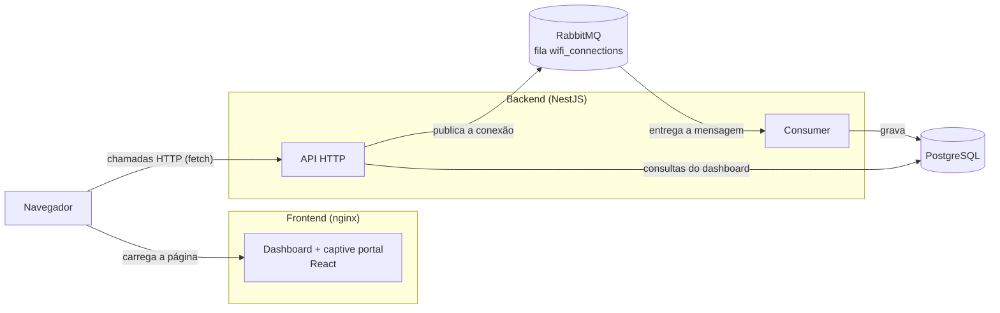
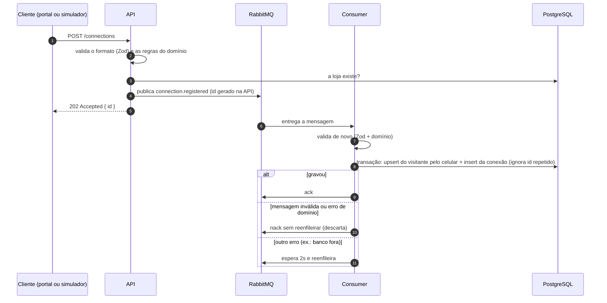

<!-- TODO: estrutura e seções organizadas. Falta escrever o conteúdo dos trechos marcados com "escrever" e apagar estes comentários antes da entrega. -->

# Arquitetura

[← Voltar ao README](../README.md)

## Visão geral

O projeto é um monorepo com npm workspaces:

```
packages/shared/contracts   schemas Zod usados pelo backend e pelo frontend, definindo contratos entre as frentes
apps/backend                API em NestJS + consumer do RabbitMQ
apps/frontend               dashboard e captive portal (React + Vite)
docker-compose.yml          postgres, rabbitmq, backend e frontend
```



O nginx só entrega os arquivos estáticos do frontend. O navegador chama a API diretamente, no endereço definido em `VITE_API_URL`. A API e o consumer rodam no mesmo processo (aplicação híbrida do NestJS).

## Fluxo de uma conexão



Como estou utilizando um banco de dados em nuvem, acredito ser importante, dependendo da viabilidade técnica e dos limites de custo, a implementação de uma ferramenta de filas, para picos de conexão de usuários, como o número de lojas reais ultrapassa 4000 e a possível queda do banco de dados em nuvem, mesmo que o downtime seja baixíssimo.

## Contratos compartilhados

O pacote `@wifi/contracts` (`packages/shared/contracts/src/`) define com Zod o formato de tudo que passa entre frontend e backend:

| Arquivo          | Conteúdo                                                                    |
| ---------------- | --------------------------------------------------------------------------- |
| `connections.ts` | registro de conexão (visitante, aparelho), evento da fila, regex do celular |
| `stores.ts`      | lojas com métricas, query e página de visitantes                            |
| `metrics.ts`     | query e resposta do resumo de visitas                                       |
| `period.ts`      | campos `from`/`to` e a regra `from <= to`                                   |
| `errors.ts`      | formato de erro da API `{ statusCode, message, issues? }`                   |

Quem usa cada schema:

- **Backend:** valida as requisições que chegam (`ZodValidationPipe`) e as mensagens que saem da fila (consumer).
- **Frontend:** valida as respostas da API (`dashboard-api.ts`) e o formulário do captive portal.

É uma ótima e interessantissima prática definir contratos/schemas de comunicação de validação entre duas frente que possuem atuações sobre o mesmo domínio e para proposta da solução utilizem os mesmos dados para trabalho.

## Arquitetura hexagonal no backend

A arquitetura hexagonal nos permite manter centralizado a parte de domínio e lógica de negócio, podendo "isolar" a aplicação da solução de software, qual facilita a questão de testes, troca de infraestrutura, por exemplo, para caso seja necessária a remoção do serviço de filas/mensageiria. Para um projeto realizado como esse para o desafio, a arquitetura hexagonal traz complexidade, mas em projetos reais aplicados, a complexidade é convertida em estrutura a longo prazo, escalabilidade, manutenabilidade e demais beneficios mencionados anteriormente em termos de código.
