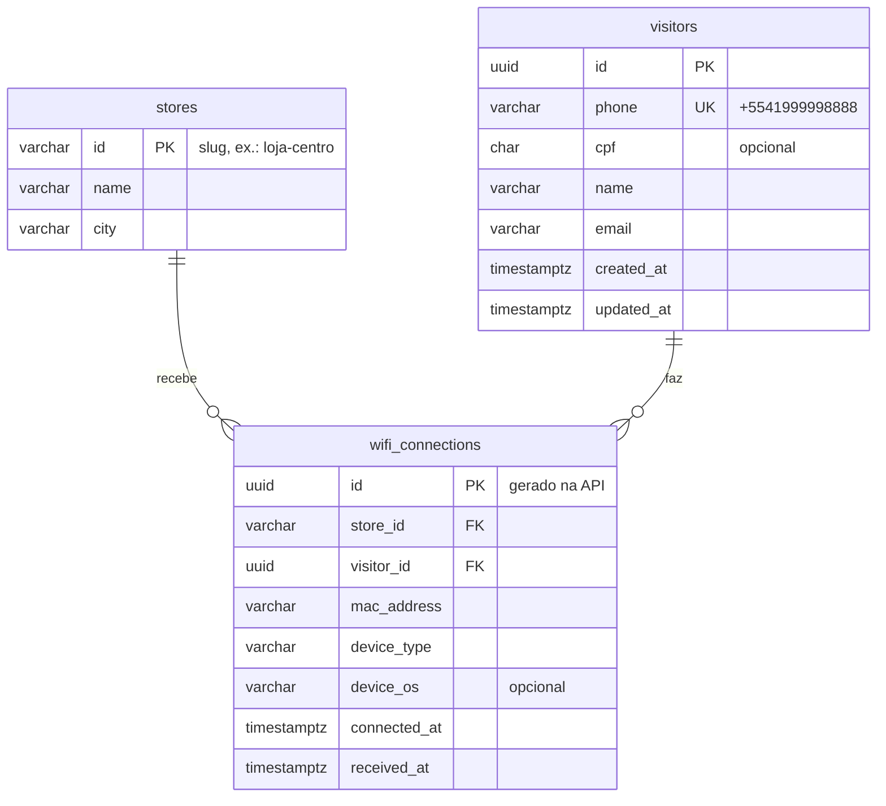

<!-- TODO: estrutura e seções organizadas. Falta escrever o conteúdo dos trechos marcados com "escrever" e apagar estes comentários antes da entrega. -->

# Backend

[← Voltar ao README](../README.md)

API em NestJS com PostgreSQL (TypeORM) e RabbitMQ, organizada em camadas (arquitetura hexagonal). Código em `apps/backend/src/`.

## Camadas

```
connections/
  domain/          regras de negócio, sem dependência de framework
  application/     portas (interfaces) e casos de uso
    ports/
    use-cases/
  infra/           adapters: o que conversa com o mundo de fora
    http/          controllers, validação (Zod) e filtro de erros
    messaging/     publisher e consumer do RabbitMQ
    persistence/   entidades do TypeORM, repositório e seed
  connections.module.ts   liga cada porta à sua implementação
health.controller.ts      GET /health
main.ts                   sobe a API HTTP e o consumer
```

### Domínio (`domain/`)

| Arquivo              | Responsabilidade                                                |
| -------------------- | --------------------------------------------------------------- |
| `wifi-connection.ts` | a conexão (agregado); recusa data no futuro (tolerância de 60s) |
| `visitor.ts`         | nome, celular, CPF opcional e e-mail                            |
| `phone.ts`           | celular BR, normalizado no formato `+5541999998888`             |
| `cpf.ts`             | dígito verificador e máscara (`***.982.247-**`)                 |
| `device.ts`          | MAC normalizado (`AA:BB:CC:DD:EE:FF`) e tipo do aparelho        |
| `domain.error.ts`    | `DomainError`, `InvalidConnectionError`, `NotFoundError`        |

### Portas e casos de uso (`application/`)

| Porta                      | Papel                              | Implementação                 |
| -------------------------- | ---------------------------------- | ----------------------------- |
| `ConnectionRepository`     | tudo que é lido e gravado no banco | `TypeOrmConnectionRepository` |
| `ConnectionEventPublisher` | publicar a conexão na fila         | `RabbitMqConnectionPublisher` |

| Caso de uso                     | Usado por                  | O que faz                                          |
| ------------------------------- | -------------------------- | -------------------------------------------------- |
| `RequestConnectionRegistration` | `POST /connections`        | valida, confere se a loja existe e publica na fila |
| `SaveConnection`                | consumer da fila           | valida de novo e grava                             |
| `GetVisitsSummary`              | `GET /metrics/visits`      | total de visitas e visitantes únicos               |
| `ListStores`                    | `GET /stores`              | lojas com visitas e visitantes únicos              |
| `ListStoreVisitors`             | `GET /stores/:id/visitors` | visitantes da loja, paginados, com o CPF mascarado |

O período das consultas é limitado a 366 dias (`application/period.ts`) para proteger o banco.

<!-- escrever: por que hexagonal, e como isso aparece nos testes (fakes em memória em
apps/backend/test/fakes). -->

## Modelo de dados



| Tabela             | Restrição / índice                       | Motivo                                               |
| ------------------ | ---------------------------------------- | ---------------------------------------------------- |
| `visitors`         | `phone` único                            | o celular identifica a pessoa                        |
| `visitors`         | índice em `cpf` (não único, aceita nulo) | busca futura por CPF; a pessoa pode trocar de número |
| `wifi_connections` | índice em `(store_id, connected_at)`     | consultas do dashboard por loja e período            |
| `wifi_connections` | índice em `visitor_id`                   | visitas de cada pessoa                               |

Os horários são `timestamptz`: o banco guarda em UTC e o frontend formata no fuso de quem está vendo.

<!-- escrever: por que o aparelho fica na conexão e não numa tabela própria, e a diferença
entre connected_at (quando aconteceu) e received_at (quando chegou no banco). -->

### Consultas do dashboard

As consultas estão em `infra/persistence/typeorm-connection.repository.ts`, em SQL direto.

<!-- escrever: as decisões de SQL que valem destaque:
- LEFT JOIN com o filtro de data no ON, pra loja sem visita não sumir da lista
- COUNT(DISTINCT visitor_id): visitante único é pessoa, não aparelho
- ARRAY_AGG(connected_at ORDER BY connected_at) pra coluna "Dias e horários"
- JOIN LATERAL ... LIMIT 1 pro último aparelho de cada pessoa
- ILIKE com % e _ escapados na busca -->

## Tratamento de erros

| Situação                                    | Onde                | Resposta                                                 |
| ------------------------------------------- | ------------------- | -------------------------------------------------------- |
| Formato inválido (query, parâmetro, body)   | `ZodValidationPipe` | 400 `{ statusCode, message: "Dados inválidos", issues }` |
| Regra de negócio (CPF, celular, data, loja) | `DomainErrorFilter` | 400 `{ statusCode, message }`                            |
| Loja não encontrada                         | `DomainErrorFilter` | 404                                                      |
| RabbitMQ indisponível ao publicar           | `DomainErrorFilter` | 503                                                      |
| Banco indisponível                          | `GET /health`       | 503                                                      |
| Mensagem fora do contrato na fila           | consumer            | descartada, com log                                      |
| Erro de domínio ao gravar                   | consumer            | descartada, com log                                      |
| Outro erro ao gravar (ex.: banco fora)      | consumer            | espera 2s e devolve a mensagem pra fila                  |

<!-- escrever: por que validar duas vezes (Zod na borda, domínio nas regras) e por que o
consumer não confia na mensagem. -->

## Configuração

Variáveis de ambiente (exemplo em `apps/backend/.env.example`):

| Variável                 | Padrão          | Descrição                                                    |
| ------------------------ | --------------- | ------------------------------------------------------------ |
| `PORT`                   | `3000`          | porta da API                                                 |
| `DATABASE_URL`           | —               | URL de conexão do PostgreSQL (alternativa aos campos abaixo) |
| `DATABASE_HOST`          | `localhost`     | host do PostgreSQL                                           |
| `DATABASE_PORT`          | `5432`          | porta do PostgreSQL                                          |
| `DATABASE_USER`          | `wifi`          | usuário                                                      |
| `DATABASE_PASSWORD`      | `wifi`          | senha                                                        |
| `DATABASE_NAME`          | `wifi`          | nome do banco                                                |
| `DATABASE_SSL`           | `false`         | `true` para bancos gerenciados que exigem SSL                |
| `DB_SYNC`                | `false`         | `true` cria e atualiza as tabelas a partir das entidades     |
| `RABBITMQ_URL`           | obrigatória     | URL do RabbitMQ (`amqp://` ou `amqps://`)                    |
| `FRONTEND_URL`           | qualquer origem | origens liberadas no CORS, separadas por vírgula             |
| `SEED_STORES`            | `false`         | `true` cria as 5 lojas de exemplo                            |
| `SEED_CONNECTIONS`       | `false`         | `true` cria conexões de exemplo se a tabela estiver vazia    |
| `SEED_CONNECTIONS_COUNT` | `6000`          | quantidade de conexões do seed                               |
| `TZ`                     | —               | fuso do processo (`America/Sao_Paulo` no Docker Compose)     |

## Dados de exemplo

- **Seed** (`infra/persistence/seed/`): roda no boot quando as variáveis `SEED_*` estão ligadas. Cria 5 lojas e, com o banco vazio, as conexões de exemplo dos últimos 365 dias. Usa uma semente fixa, então gera sempre os mesmos dados, e passa pela entidade de domínio, então segue as mesmas regras de uma conexão real.
- **Simulador** (`scripts/simulate-connections.mjs`): manda conexões pelo `POST /connections`, passando pela API, pela fila e pelo consumer. Uso: `node scripts/simulate-connections.mjs [quantidade] [urlDaApi]`.

<!-- escrever: os padrões que o seed simula (loja "da pessoa", horários de pico, pessoas com
dois aparelhos, parte sem CPF) e por quê. -->

## Testes

Vitest, com fakes em memória (`apps/backend/test/fakes/`) no lugar do banco e da fila. Cobrem o domínio, os casos de uso e o seed.

```bash
npm test -w backend
```
