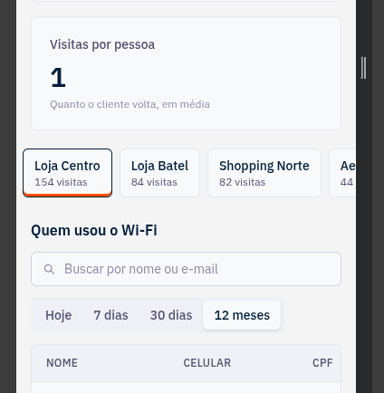

# Frontend

[← Voltar ao README](../README.md)

Aplicação React + Vite + Tailwind CSS, servida pelo nginx. Código em `apps/frontend/src/`.

## Telas e rotas

As rotas usam a History API do navegador, sem biblioteca de roteamento. O `main.tsx` escolhe a página pelo caminho.

| Rota          | Tela                                                                                        |
| ------------- | ------------------------------------------------------------------------------------------- |
| `/`           | totais e padrões de visita da rede, e grade de lojas, com busca por nome ou cidade          |
| `/lojas/:id`  | loja selecionada: lista de lojas, 3 indicadores, padrões de visita e a tabela de visitantes |
| `/portal`     | captive portal (simulação), aberto na primeira loja                                         |
| `/portal/:id` | captive portal de uma loja específica                                                       |

O nginx devolve o `index.html` para qualquer rota desconhecida (`nginx.conf`), então os links de loja e do portal funcionam ao abrir direto ou recarregar a página.

### Dashboard

- **Rede:** visitas e visitantes únicos de todas as lojas.
- **Loja:** visitas, visitantes únicos e visitas por pessoa.
- **Padrões de visita:** dia da semana, horário e estação com mais visitas, da rede (na tela inicial) e de cada loja. Cada um mostra o pico em destaque e as barras de todos os valores.
- **Lista de lojas:** abas verticais no desktop, com navegação pelas setas do teclado; faixa horizontal acima da tabela no celular.
- **Tabela de visitantes:** busca por nome ou e-mail, paginação, filtro de período (Hoje, 7 dias, 30 dias, 12 meses; padrão 12 meses), celular, CPF mascarado, número de visitas, dias e horários de cada visita, última conexão e último aparelho.

Os indicadores e os padrões de visita, da rede e das lojas, usam sempre os últimos 12 meses; o filtro de período vale só para a tabela.

### Captive portal

- Campos obrigatórios: nome, celular e e-mail. Celular e CPF são formatados enquanto a pessoa digita.
- CPF opcional, numa caixa "Clube de vantagens".
- Aceite dos termos de uso obrigatório.
- A mensagem de sucesso muda conforme a pessoa informou o CPF ou não.
- O aparelho é simulado: MAC aleatório e tipo do aparelho tirado do user agent do navegador (no portal real, esses dados vêm do roteador).

O filtro de período fica somente atrelada a tabela, facilitando o acesso e a troca do filtro, deixando claro a qual componente o filtro tem atuação, já no mobile, as lojas através de uma navbar, facilita a compactação visual necessária para menor carga de informações em dispositivos móveis.



## Organização do código

```
api/          cliente HTTP da API e o contexto que injeta ele nas telas
components/   componentes visuais (cards, gráficos de barras, tabela, abas, faixa, filtro de período…)
hooks/        busca de dados, debounce, rota da loja e cálculo do período
pages/        DashboardPage e CaptivePortalPage
utils/        formatação (números, datas, celular, CPF, dia da semana, estação), filtro de lojas, aparelho simulado
main.tsx      escolhe a página pelo caminho
main.css      tema (tailwindcss)
```

## Comunicação com a API

- **`api/http.ts`:** faz as chamadas com `fetch`, **valida toda resposta com os schemas de `@wifi/contracts`** e transforma falhas em `ApiRequestError` com uma mensagem pronta para a tela.
- **`api/dashboard-api.ts`** e **`api/portal-api.ts`:** as chamadas de cada tela. O dashboard lê métricas, padrões de visita, lojas e visitantes; o portal lê as lojas e registra a conexão.
- **`api/api-context.tsx`:** injeta em cada tela só a API que ela usa. Nos testes, uma API fake entra no lugar.
- **`hooks/use-api-query.ts`:** controla carregando, erro e "tentar novamente", e cancela a requisição anterior quando os filtros mudam, pra uma resposta antiga não sobrescrever uma mais nova.

O endereço da API vem de `VITE_API_URL`, definido no build (padrão `http://localhost:3000`).

## Estados da interface

| Estado           | Como aparece                                         |
| ---------------- | ---------------------------------------------------- |
| Carregando       | skeletons no lugar de cards, grade e tabela          |
| Vazio            | mensagem explicando (nenhuma loja, nenhum visitante) |
| Erro             | mensagem com o motivo e botão "Tentar novamente"     |
| Loja inexistente | aviso com botão para voltar à lista de lojas         |

## Testes

Vitest e Testing Library, simulando o uso real (clicar, digitar, navegar pelo teclado), com a API fake.

```bash
npm test -w frontend
```
