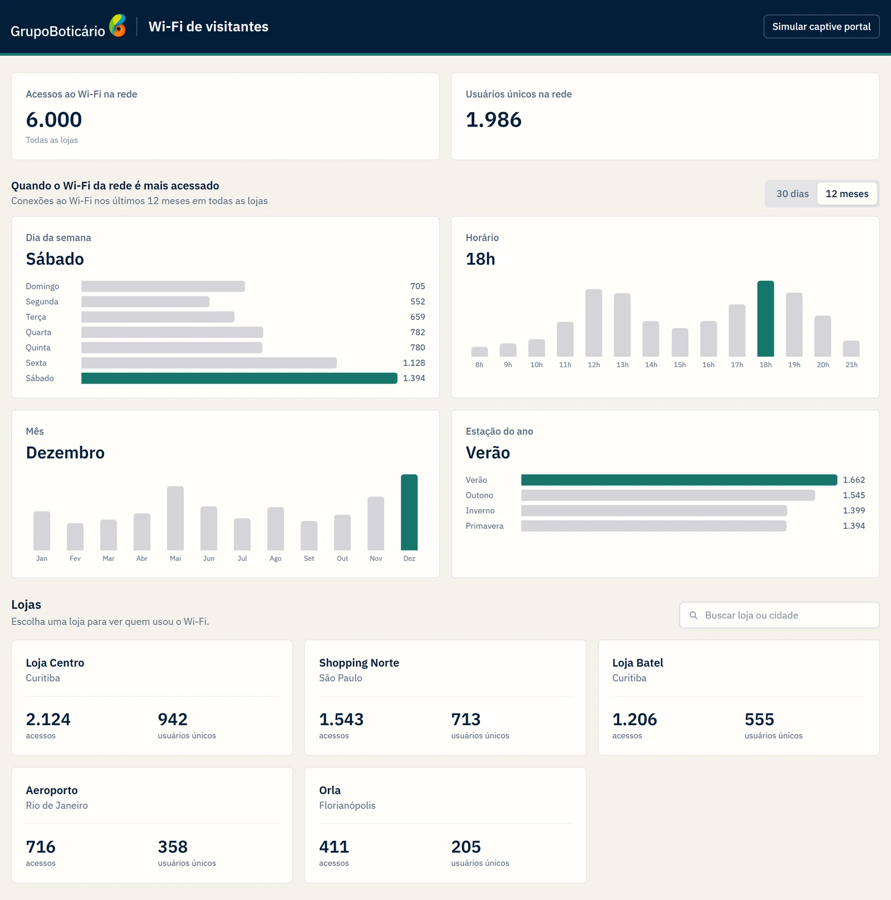
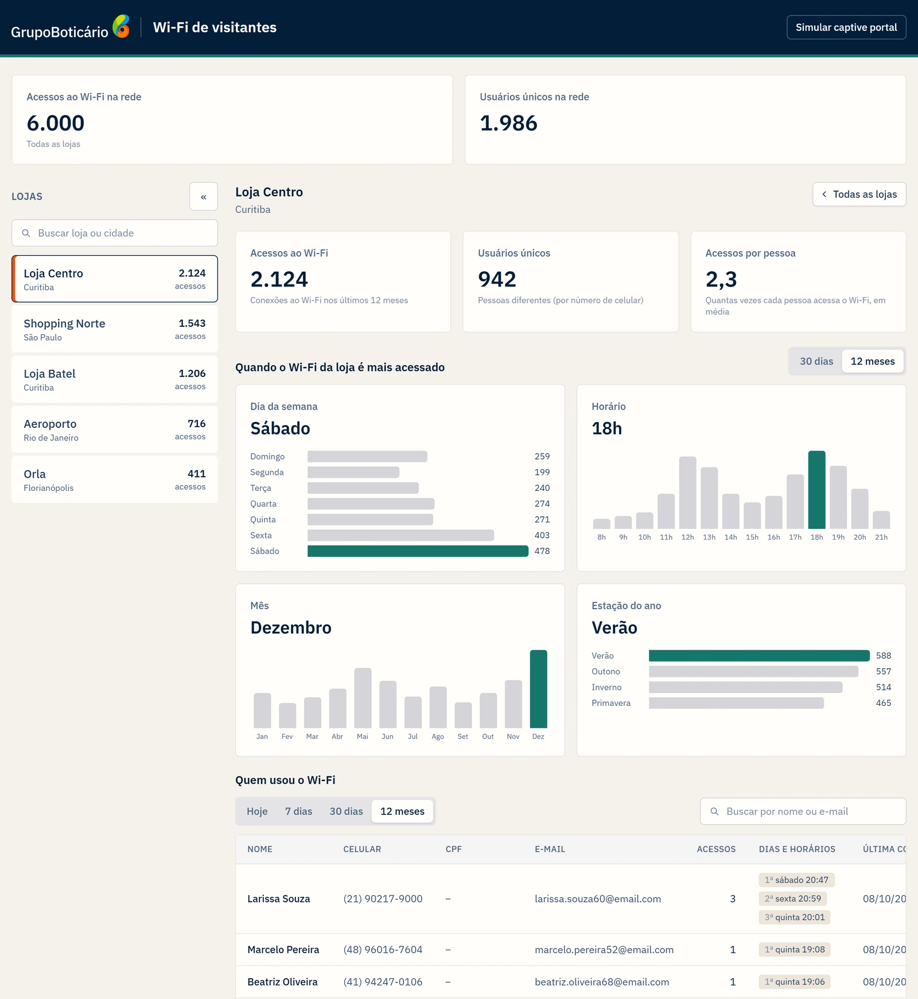
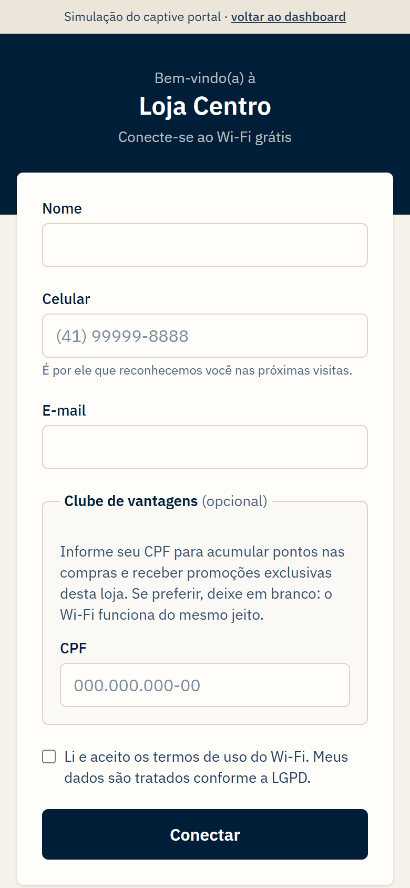
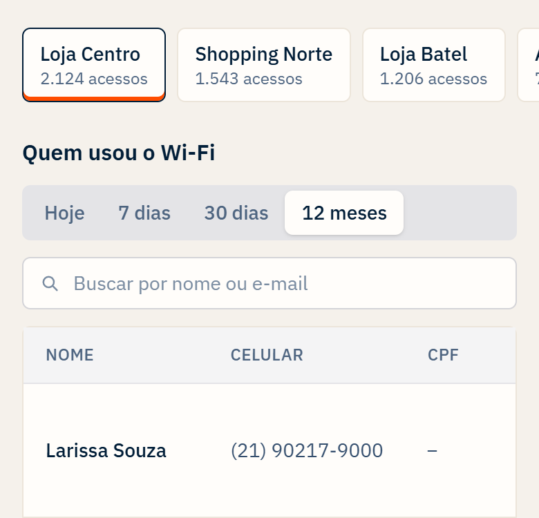

# Frontend

[← Voltar ao README](../README.md)

Aplicação React + Vite + Tailwind CSS, servida pelo nginx. Código em `apps/frontend/src/`.

## Telas e rotas

As rotas usam a History API do navegador, sem biblioteca de roteamento. O `main.tsx` escolhe a página pelo caminho.

| Rota          | Tela                                                                                      |
| ------------- | ----------------------------------------------------------------------------------------- |
| `/`           | totais e padrões de acesso da rede, e grade de lojas, com busca por nome ou cidade        |
| `/lojas/:id`  | loja selecionada: lista de lojas, 3 indicadores, padrões de acesso e a tabela de usuários |
| `/portal`     | captive portal (simulação), aberto na primeira loja                                       |
| `/portal/:id` | captive portal de uma loja específica                                                     |

O nginx devolve o `index.html` para qualquer rota desconhecida (`nginx.conf`), então os links de loja e do portal funcionam ao abrir direto ou recarregar a página.

### Dashboard

- **Rede:** acessos ao Wi-Fi e usuários únicos de todas as lojas.
- **Loja:** acessos ao Wi-Fi, usuários únicos e acessos por pessoa.
- **Padrões de acesso:** dia da semana, horário, mês e estação com mais acessos, da rede (na tela inicial) e de cada loja, com filtro de 30 dias ou 12 meses (padrão 12 meses). Cada um mostra o pico em destaque e as barras de todos os valores.
- **Lista de lojas:** abas verticais no desktop, com navegação pelas setas do teclado, que podem ser recolhidas para ampliar a área da loja; faixa horizontal acima da tabela no celular.
- **Tabela de usuários:** busca por nome ou e-mail (com botão para limpar), paginação, filtro de período (Hoje, 7 dias, 30 dias, 12 meses; padrão 12 meses), celular, CPF mascarado, número de acessos, dias e horários de cada acesso, última conexão e último aparelho.

Os indicadores, da rede e das lojas, usam sempre os últimos 12 meses. Os padrões de acesso e a tabela têm, cada um, o próprio filtro de período.

Tela inicial, com a visão da rede:



Loja selecionada:



### Captive portal

- Campos obrigatórios: nome, celular e e-mail. Celular e CPF são formatados enquanto a pessoa digita.
- CPF opcional, numa caixa "Clube de vantagens".
- Aceite dos termos de uso obrigatório.
- A mensagem de sucesso muda conforme a pessoa informou o CPF ou não.
- O aparelho é simulado: MAC aleatório e tipo do aparelho tirado do user agent do navegador (no portal real, esses dados vêm do roteador).



Cada filtro de período fica junto do componente em que atua (padrões de acesso e tabela), facilitando o acesso e a troca do filtro, deixando claro a qual componente o filtro tem atuação, já no mobile, as lojas através de uma navbar, facilita a compactação visual necessária para menor carga de informações em dispositivos móveis.



## Escolhas de UX e UI

As telas foram pensadas para o dono da loja, que precisa entender os números rapidamente, sem conhecimento técnico, tanto no computador quanto no celular.

### Hierarquia da informação

- **Da rede para a loja, e da loja para o usuário.** A tela inicial mostra a visão da rede (indicadores, padrões de acesso e a grade de lojas), sem nenhuma loja selecionada. Ao escolher uma loja, aparecem os detalhes dela, e o botão "Todas as lojas" volta para a visão geral. Cada nível mostra só o que faz sentido naquele momento.
- **Resposta primeiro, detalhe depois.** Os indicadores mostram o número em destaque e uma explicação curta embaixo (ex.: "Pessoas diferentes (por número de celular)"). Nos padrões de acesso, o pico aparece em destaque no topo do cartão (ex.: "Sábado"), com a barra correspondente em verde; as demais barras, em cinza, dão o contexto.
- **Linguagem do negócio.** Os números são apresentados como acessos ao Wi-Fi, e não como visitas à loja, já que uma pessoa pode visitar a loja sem conectar e uma visita pode gerar mais de um acesso. Os números seguem o formato brasileiro (6.000; 2,3), com algarismos de mesma largura, para não "dançarem" quando os valores mudam.

### Filtros e navegação

- **Cada filtro junto do que filtra.** O período dos padrões de acesso fica no cabeçalho do bloco, e o da tabela fica acima da tabela, então fica claro o que cada um altera. Nos padrões, há apenas 30 dias e 12 meses, porque em "Hoje" ou "7 dias" os gráficos de mês e estação ficariam com uma única barra.
- **Busca que acompanha a digitação.** A busca espera a pessoa parar de digitar antes de consultar, tem um botão para limpar e volta para a primeira página quando a busca ou o período mudam.
- **Cada loja tem endereço próprio.** O link `/lojas/:id` abre a loja diretamente, pode ser compartilhado e funciona com o botão voltar do navegador.
- **Espaço para os dados.** No desktop, a lista de lojas pode ser recolhida, ampliando a área da loja e da tabela. A loja selecionada fica marcada em laranja e não pode ser clicada novamente (cursor de "não permitido").

### Feedback e estados

- **Carregamento sem saltos.** Os skeletons têm o formato do conteúdo final e, ao trocar um filtro, os dados anteriores continuam na tela com opacidade reduzida até a nova resposta chegar, em vez de a área ficar vazia.
- **Erros que dizem o que fazer.** Cada bloco mostra o próprio erro, em português, com o botão "Tentar novamente", e uma falha em um bloco não esconde os outros.
- **Interações com resposta visual.** Todos os botões têm o cursor de clique, mudança de cor suave ao passar o mouse (`transition-colors`) e contorno visível ao navegar pelo teclado.

### Identidade visual

- **Cores do Grupo Boticário.** Cabeçalho em azul-marinho com o logo, fundo em tom creme, verde para destacar os dados (como o pico de cada gráfico) e o laranja da marca para marcar a loja selecionada. Filtros e barras neutras usam cinza, para não competir com os dados.
- **Conforto visual.** O fundo creme substitui o branco puro, que cansa a vista em telas de uso prolongado, e os cantos levemente arredondados deixam a interface mais sóbria.
- **Contraste.** O tom de verde foi escolhido para manter o contraste do texto acima do mínimo recomendado (4,5:1). Um verde mais claro, também presente na marca, ficaria abaixo desse mínimo.
- **Tipografia.** IBM Plex Sans, legível tanto em números quanto em textos curtos.

### Celular

- A lista de lojas vira uma faixa horizontal logo acima da tabela, perto do conteúdo que ela controla.
- Os filtros ficam empilhados, e a busca ocupa a largura toda.
- Tabelas largas rolam dentro do próprio bloco, sem empurrar a página para os lados.

### Formulário do captive portal

- **Formulário curto.** Apenas nome, celular e e-mail são obrigatórios, e o celular e o CPF são formatados enquanto a pessoa digita.
- **CPF apresentado como benefício.** O campo fica em uma caixa "Clube de vantagens (opcional)", que explica o que a pessoa ganha ao informar, e a mensagem de sucesso muda conforme o CPF foi informado ou não.
- **Erros no campo certo.** O formulário usa as mesmas regras da API, então o erro aparece no campo antes do envio, e um erro devolvido pela API também é levado ao campo correspondente.
- **Simulação separada do produto.** Uma faixa no topo avisa que se trata de uma simulação, com link para voltar ao dashboard, e os controles da simulação (troca de loja e aparelho simulado) ficam em uma caixa tracejada abaixo do formulário, separados do que seria a tela real.

Os cuidados de acessibilidade (papéis do ARIA e navegação pelo teclado) estão em [Arquitetura do frontend](./arquitetura.md#arquitetura-do-frontend).

## Organização do código

```
api/          cliente HTTP da API e o contexto que injeta ele nas telas
components/   componentes visuais (cards, gráficos de barras e de colunas, tabela, abas, faixa, filtro de período…)
hooks/        busca de dados, debounce, rota da loja e cálculo do período
pages/        DashboardPage e CaptivePortalPage
utils/        formatação (números, datas, celular, CPF, dia da semana, estação), filtro de lojas, aparelho simulado, itens dos gráficos
main.tsx      escolhe a página pelo caminho
main.css      tema (tailwindcss)
```

## Comunicação com a API

- **`api/http.ts`:** faz as chamadas com `fetch`, **valida toda resposta com os schemas de `@wifi/contracts`** e transforma falhas em `ApiRequestError` com uma mensagem pronta para a tela.
- **`api/dashboard-api.ts`** e **`api/portal-api.ts`:** as chamadas de cada tela. O dashboard lê métricas, padrões de acesso, lojas e usuários; o portal lê as lojas e registra a conexão.
- **`api/api-context.tsx`:** injeta em cada tela só a API que ela usa. Nos testes, uma API fake entra no lugar.
- **`hooks/use-api-query.ts`:** controla carregando, erro e "tentar novamente", e cancela a requisição anterior quando os filtros mudam, pra uma resposta antiga não sobrescrever uma mais nova.

O endereço da API vem de `VITE_API_URL`, definido no build (padrão `http://localhost:3000`).

## Estados da interface

| Estado           | Como aparece                                                                 |
| ---------------- | ---------------------------------------------------------------------------- |
| Carregando       | skeletons no lugar de cards, grade e tabela                                  |
| Vazio            | mensagem explicando (nenhuma loja, nenhum usuário, nenhum acesso no período) |
| Erro             | mensagem com o motivo e botão "Tentar novamente"                             |
| Loja inexistente | aviso com botão para voltar à lista de lojas                                 |

## Testes

Vitest e Testing Library, simulando o uso real (clicar, digitar, navegar pelo teclado), com a API fake.

```bash
npm test -w frontend
```
